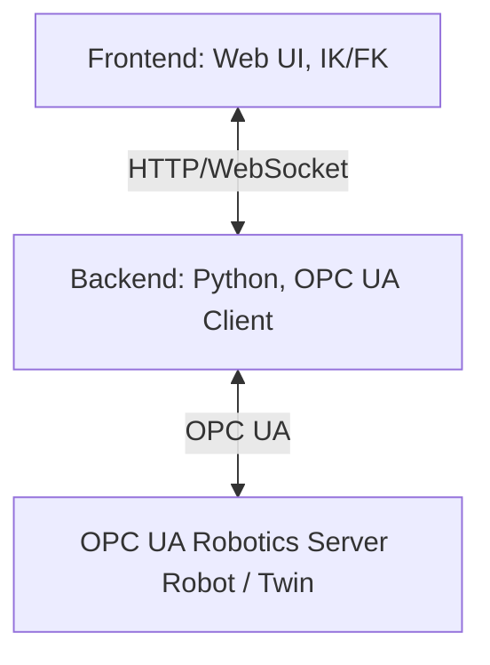

[](https://doi.org/10.5281/zenodo.17034716)

# WebSkillComposition
**WebSkillComposition** is a web-based system for skill-based control of industrial robots.
  
It consists of a **Python backend** for OPC UA connection and a **web frontend** with inverse and forward kinematics logic.
The goal is to be able to control robots such as **Franka Research 3**, **EVA Automata**, and **UR5e** via a uniform web interface.

---

## Citation  

If you use this repository in your work, please cite our paper.  
We will add the full citation once the paper is accepted and published.

---

## Project Structure  

The project consists of a **backend** and a **frontend**.

- **Backend**  
  Written in Python. It connects to an OPC UA Robotics Server as a client.  
  It provides HTTP and WebSocket endpoints for the frontend and delivers URDF files (including meshes and textures) for supported robots.

- **Frontend**  
  A web interface for robot control.  
  It handles visualization as well as inverse kinematics (IK) and forward kinematics (FK).


## Architecture Overview  




## Main Goals  

- Support multiple robots in one scene without opening multiple socket connections.  
- Keep IK/FK calculations stable even when robots are placed at different positions.  
- Have one clear place where robot state is stored (per robot in the frontend, per URL in the backend).  
- Keep transport logic, OPC UA logic, and UI logic separated.


## Frontend workflow:

When a robot is added, the `robotManager` creates a new robot record. Then the `sceneManager` loads the URDF into its own rig (`THREE.Group`) and places it in the scene with a small offset so robots don’t overlap. After that, the `URDFIKManipulator` is attached to handle IK and FK.

When the user moves a robot (either with IK or by dragging joints in FK), the joint values update and the sliders/UI reflect the changes. If OPC UA sync is enabled, the backend also receives and sends updates, which are applied to the correct robot using the robot URL.

Some important design choices we did:

- We use only one viewer instance as scene that provides the camera.
- Each robot has its own rig to handle world offsets cleanly.
- Only the active robot can be controlled (IK + dragging), so robots don’t interfere with each other.
- All robots share one WebSocket connection instead of opening a new one per robot.
- Robot states are stored per robot inside the `robotManager`, instead of using global variables.

---

### Frontend Interfaces in Detail:

- `frontend/src/robot/robotManager.js`:  
  Manages the per-robot state (which used to be global), such as connection status, UI state, and OPC UA information. It keeps track of the active robot and makes sure shared resources like the WebSocket are reused instead of recreated.

- `frontend/src/scene/sceneManager.js`:  
  Loads a URDF into a rig and adds it to the scene. Each robot gets its own rig (`THREE.Group`) which handles the world position (slot offset). The robot itself stays at `(0,0,0)` locally. This keeps IK/FK calculations easy and avoids problems with the offset.  

- `frontend/src/URDFIKManipulator.js`:  
  Acts as the IK/FK controller for one robot. This means each robot has one URDFIKManipulator instance. The gizmo is attached to the rig so slot offsets do not break IK. Drag controls are created per robot, so selecting and moving joints only affects the correct robot.

- `frontend/src/opcua/connection.js` (with `addressSpace.js` and `contextMenu.js`):  
  Uses one shared WebSocket connection to the backend. Messages include the robot URL so the frontend knows which robot the update belongs to. Joint mappings, sync toggles, subscriptions, and status updates are handled per robot and applied only to the active one.

- `frontend/src/ui/*`:  
  Helper modules for layout, logging, and switching the interface to match the active robot. The UI states (address space HTML etc.) for each robot is stored inside the `robotManager`.


## Backend workflow:

When the frontend sends a connect request, the WebSocket router forwards it to the `OPCUAClient`.  
The client connects to the OPC UA server and the `SubscriptionManager` searches for relevant nodes (axes, modes, etc.).  
Once subscriptions are active, joint and mode updates are streamed back to the frontend.

The backend also provides REST endpoints to browse the OPC UA address space, which is shown in the UI.

Important design choices:

- Only one shared WebSocket connection is used.
- Messages include the robot URL so the backend knows which robot/client they belong to.
- A `ClientRegistry` keeps track of which URL is connected to which OPC UA client.
- OPC UA logic is split into smaller modules (client, subscriptions, browsing, transport) to keep responsibilities clear and testing easier.

### Backend Components in Detail:

- `backend/main.py`:  
  FastAPI entry point. It connects REST routes, WebSocket routing, and the MCP sub-application into one service.

- `backend/src/dt_robot_control/opcua/opcua_client.py`:  
  Wraps `asyncua.Client`. Handles connect/disconnect logic and OPC UA method calls.

- `backend/src/dt_robot_control/opcua/subscription_manager.py`:  
  Finds axis, mode, and other relevant nodes and manages subscriptions.

- `backend/src/dt_robot_control/opcua/node_manager.py`:  
  Provides browsing and search utilities for the OPC UA address space.

- `backend/src/dt_robot_control/opcua/endpoints.py`:  
  REST endpoints for listing and browsing OPC UA nodes.

- `backend/src/dt_robot_control/websocket/`:  
  WebSocket routing and handlers used by the frontend.

- `backend/src/dt_robot_control/server/mcp.py`:  
  MCP tool server and WebSocket bridge.Forwards pose, quaternion, and joint data from the browser and sends MCP commands back.

---
---
## Prerequisites
For development, you will need:
- **Git**
- **Python 3.11+** (recommended)
- **Node.js LTS** (e.g., 20.x) + **npm**
- **uv** (Python package manager from Astral)
- **git lfs** (for Linux and Mac)

### Installation:
  
- macOS/Linux:
    ```bash
    curl -LsSf https://astral.sh/uv/install.sh | sh
    ```
    Inside the project execute:
    ```
    git lfs install && git lfs pull
    ```
    
- Windows (PowerShell):
```powershell
    iwr https://astral.sh/uv/install.ps1 -UseBasicParsing | iex
```
- Access to an **OPC UA Robotics Server** (e.g., Franka controller, simulator, or digital twin)
> If you don't want to use **uv**, you can also work with `venv` + `pip`.


## Installation & Start
### 1. Set up the backend
Change to the backend directory:
```bash
cd backend
uv pip install -e .          # Installs the dependencies and builds the dt_robot_control package
uv run main.py               # Start backend
```
### 2. Set up the frontend
Start frontend:
```bash
cd frontend
npm install
npm run start               # Start frontend
```
## Functions
WebSkillComposition follows a clearly structured workflow that supports both **offline** and **online programming**.
This allows you to first simulate robot movements safely and then transfer them directly to the physical robot—all within the same user interface.
### 1. Select robot and start digital twin
- Select a **robot URDF model** (e.g., Franka R3, EVA, UR5e) in the control panel.
- The model is loaded in the 3D view and the **kinematic simulation** is immediately ready for use.
- The same IK/FK logic works for all supported models.
### 2. Select control mode

**Offline mode**:

- No connection to the real robot.
- Perfect for **planning, simulation, and testing**.
- Movements only affect the digital twin.

**Online mode**:

- Connect to an **OPC UA Robotics Server**.
- Live data from the physical robot is transferred.
- Movements from the digital twin are sent to the real robot.

### 3. Create movements
**Joint space control**:
    
- Adjust joint angles directly using sliders or by dragging individual joints in the 3D model.

**Task Space Control (TCP)**:

- Move or rotate the tool center point (TCP) using a yellow control ball.
- Inverse kinematics automatically calculates the appropriate joint angles.

**Lead-Through (Hand-Guiding)** – only in online mode with supported cobots:
- Move the robot by hand; changes are displayed directly in the digital twin.

### 4. Execute skills
Each movement or action is based on a **skill**:
- **JointPTPMoveSkill**: Point-to-point movement in the joint space.
- **EndEffSkill**: Open/close grippers or other end effector operations.
- Skills are **standardized** and work identically for all connected robots.
### 5. Activate live synchronization
In online mode, **digital and physical twins** can be continuously synchronized:
- Changes to the physical robot -> immediately visible in the digital twin.
- Manipulations in the digital twin -> immediate execution on the physical robot.
### 6. Monitor and analyze
- Browse the address structure of the robot in the **OPC UA browser**.
- Subscribe to variables and events (e.g., joint positions, temperatures, errors).
- Track messages in the log panel (status, warnings, errors).
---
**How you can put WebSkillComposition to practical use:**
1. Select a robot and simulate it kinematically in the browser.
2. Test movements and skills in offline mode.
3. Establish a connection to the physical robot.
4. Execute the same skills live – manufacturer-independent and standardized.
5. Monitor status and feedback live.
  
## Keyboard shortcuts
While working with the WebSkillComposition 3D viewer, you can quickly switch between view, transformation, and IK control modes using the keyboard.
These shortcuts enable smooth operation without having to constantly click on UI elements.
| Key | Function |
|-------|----------|
| **Q** | Switch between **world** and **local coordinate systems** for transformations |
| **W** | Set transformation mode to **Translation** |
| **E** | Set transformation mode to **Rotation** |
| **T** | **Show or hide** the IK interface for manipulating the end effector |
---
