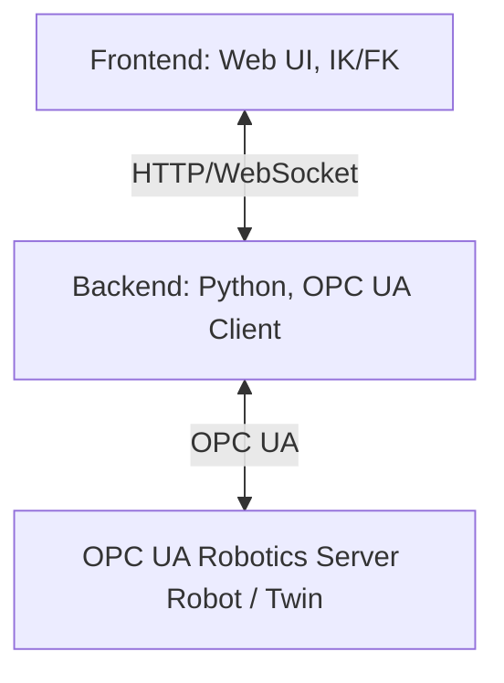

[](https://doi.org/10.5281/zenodo.17034716)

# WebSkillComposition
**WebSkillComposition** is a web-based system for skill-based control of industrial robots.
  
It consists of a **Python backend** for OPC UA connection and a **web frontend** with inverse and forward kinematics logic.
The goal is to be able to control robots such as **Franka Research 3**, **EVA Automata**, and **UR5e** via a uniform web interface.

---

## Citation

If you intend to work with this repository, please cite the paper:

Citation information will be updated once the paper is accepted and published.

## Structure
The project is divided into two main folders:
- **Backend/**
 Contains the Python backend, which communicates with an OPC UA Robotics Server as an OPC UA client.
    
It provides an HTTP and WebSocket interface for the frontend and delivers URDF files for supported robots (including meshes and textures).
- **frontend/**
  
Contains the web interface for skill-based control and the logic for inverse kinematics (IK) and forward kinematics (FK).
**Architecture overview:**



---
## Prerequisites
For development, you will need:
- **Git**
- **Python 3.11+** (recommended)
- **Node.js LTS** (e.g., 20.x) + **npm**
- **uv** (Python package manager from Astral)

Installation:
  
- macOS/Linux:
    ```bash
    curl -LsSf https://astral.sh/uv/install.sh | sh
    ```
- Windows (PowerShell):
```powershell
    iwr https://astral.sh/uv/install.ps1 -UseBasicParsing | iex
```
- Access to an **OPC UA Robotics Server** (e.g., Franka controller, simulator, or digital twin)
> If you don't want to use **uv**, you can also work with `venv` + `pip`.


## Installation & Start
### 1. Set up the backend
Change to the backend directory:
```bash
cd Backend
uv run main.py               # Start backend
```
### 2. Set up the frontend
Start frontend:
```bash
cd frontend
npm install
npm run dev               # Start frontend
```
For Functionalities regarding the frontend check the corisponding README