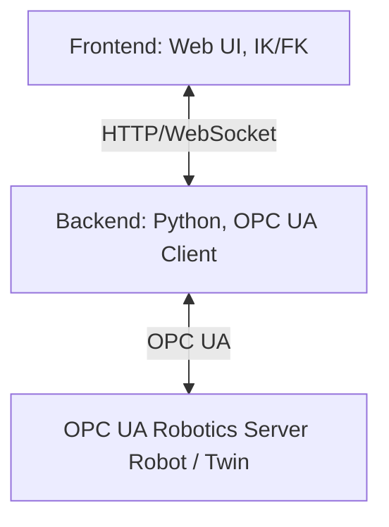

[](https://doi.org/10.5281/zenodo.17034716)

# WebSkillComposition
**WebSkillComposition** is a web-based system for skill-based control of industrial robots.
  
It consists of a **Python backend** for OPC UA connection and a **web frontend** with inverse and forward kinematics logic.
The goal is to be able to control robots such as **Franka Research 3**, **EVA Automata**, and **UR5e** via a uniform web interface.

---

## Citation

If you intend to work with this repository, please cite the paper:

Citation information will be updated once the paper is accepted and published.

## Structure
The project is divided into two main folders:
- **Backend/**
 Contains the Python backend, which communicates with an OPC UA Robotics Server as an OPC UA client.
    
It provides an HTTP and WebSocket interface for the frontend and delivers URDF files for supported robots (including meshes and textures).
- **frontend/**
  
Contains the web interface for skill-based control and the logic for inverse kinematics (IK) and forward kinematics (FK).
**Architecture overview:**



### Architecture goals
- **Multi‑robot in one scene** without duplicated sockets or conflicting UI state.
- **Stable IK/FK math** regardless of world offsets (slot placement).
- **Single source of truth** for robot state (per‑robot records in the frontend, per‑URL clients in the backend).
- **Clear separation of concerns** between transport, OPC UA logic, and UI/UX.

### Frontend Interfaces (multi-robot)
- `frontend/src/robot/robotManager.js`: Registry for all robots. Keeps per-robot state (connectivity, UI, OPC UA info), hands out the active robot, assigns slot indices so rigs do not overlap, and shares one OPC UA socket instead of reconnecting per robot.
- `frontend/src/scene/sceneManager.js`: Loads a URDF into a rig and offsets it by slot. The rig carries the world transform so the robot itself can stay at origin for IK/FK stability; `disposeRobotNode` frees GPU resources when a robot is removed.
- `frontend/src/URDFIKManipulator.js`: Per-robot IK/FK controller. Gizmo/target live on the rig so slot offsets don’t break IK; drag controls are rebuilt per robot to scope raycasting/highlighting. Emits `angle-change`, `manipulate-start/end`; press `t` to toggle IK gizmo vs FK joint dragging.
- `frontend/src/opcua/connection.js` (plus `addressSpace.js`, `contextMenu.js`): Uses one shared backend WebSocket and demuxes messages by URL to the right robot. Maintains per-robot axis→joint maps, sync toggles, subscriptions, and status UI only for the active robot.
- `frontend/src/ui/*`: UI helpers (layout, logging, robot UI state) that read/write the per-robot state exposed by `robotManager`.

**Rig + baseGroup:** Each robot is loaded into its own rig (`THREE.Group`) that carries the slot/world offset. The robot stays at local origin so IK/FK math remains stable. Manipulators attach their gizmo to that rig via `baseGroup` so the offset is applied once, not twice. Removing a robot also removes its rig and frees GPU resources.

### Frontend data flow (high level)
1. **Add robot** → `robotManager` creates a record → `sceneManager` spawns a rig → `URDFIKManipulator` binds to the robot.
2. **User interaction** → IK gizmo or FK dragging updates joints → `angle-change` events update sliders and MCP stream.
3. **OPC UA sync** (optional) → backend streams joint/mode updates → frontend demuxes by URL and updates the active robot UI.

### Frontend design decisions
- **Single viewer instance**: reduces GPU overhead and keeps controls consistent; per‑robot manipulators reuse scene resources.
- **Per‑robot drag controls**: raycasting is scoped to the active robot to prevent cross‑robot selection.
- **Active robot focus**: only the focused robot has IK gizmos enabled; inactive robots stay in FK mode.

### Backend Service (FastAPI + OPC UA)
- `backend/main.py`: FastAPI entrypoint that wires OPC UA routes, the WebSocket router, and the MCP sub-app into one server with a shared lifespan and CORS restricted to `http://localhost:1234`.
- `backend/src/dt_robot_control/opcua/opcua_client.py`: Wrapper around `asyncua.Client` (connect/disconnect, robotics helpers, dynamic method calls, optional WebSocket pushes to the frontend).
- `backend/src/dt_robot_control/opcua/subscription_manager.py`: Discovers axes/mode/custom nodes and manages data/event subscriptions.
- `backend/src/dt_robot_control/opcua/node_manager.py`: Browsing/search utilities (BFS, DisplayName/BrowseName matching) used by the client and subscription handlers.
- `backend/src/dt_robot_control/opcua/endpoints.py`: REST endpoints to list/browse OPC UA nodes.
- `backend/src/dt_robot_control/websocket/`: WebSocket endpoints consumed by the frontend for OPC UA messaging and slot routing.
- `backend/src/dt_robot_control/server/mcp.py`: MCP tool server and WebSocket bridge; mirrors TCP pose/quaternion/joints from the browser and relays MCP tool commands back.

### Backend data flow (high level)
1. **Connect request** → `websocket/router.py` → `handlers.py` → `OPCUAClient.connect()`.
2. **Subscriptions** → `SubscriptionManager` discovers nodes → `SubHandler` streams `x|angles`, `x|Mode`, `x|event` payloads.
3. **REST rendering** → `endpoints.py` + `address_space_helpers.py` produce HTML fragments for the address space UI.

### Backend design decisions
- **One shared WebSocket**: frontend sends `url|...` prefixed messages so multiple robots multiplex over a single socket.
- **Client registry**: `ClientRegistry` is the single source of truth for URL→client mapping.
- **Modular OPC UA logic**: traversal (`NodeManager`), subscriptions (`SubscriptionManager`), and transport are decoupled.

---
## Prerequisites
For development, you will need:
- **Git**
- **Python 3.11+** (recommended)
- **Node.js LTS** (e.g., 20.x) + **npm**
- **uv** (Python package manager from Astral)
- **git lfs** (for Linux and Mac)

### Installation:
  
- macOS/Linux:
    ```bash
    curl -LsSf https://astral.sh/uv/install.sh | sh
    ```
    Inside the project execute:
    ```
    git lfs install && git lfs pull
    ```
    
- Windows (PowerShell):
```powershell
    iwr https://astral.sh/uv/install.ps1 -UseBasicParsing | iex
```
- Access to an **OPC UA Robotics Server** (e.g., Franka controller, simulator, or digital twin)
> If you don't want to use **uv**, you can also work with `venv` + `pip`.


## Installation & Start
### 1. Set up the backend
Change to the backend directory:
```bash
cd backend
uv pip install -e .              # Installs the dependencies and builds the dt_robot_control package
uv run main.py               # Start backend
```
### 2. Set up the frontend
Start frontend:
```bash
cd frontend
npm install
npm run start               # Start frontend
```
## Functions
WebSkillComposition follows a clearly structured workflow that supports both **offline** and **online programming**.
This allows you to first simulate robot movements safely and then transfer them directly to the physical robot—all within the same user interface.
### 1. Select robot and start digital twin
- Select a **robot URDF model** (e.g., Franka R3, EVA, UR5e) in the control panel.
- The model is loaded in the 3D view and the **kinematic simulation** is immediately ready for use.
- The same IK/FK logic works for all supported models.
### 2. Select control mode

**Offline mode**:

- No connection to the real robot.
- Perfect for **planning, simulation, and testing**.
- Movements only affect the digital twin.

**Online mode**:

- Connect to an **OPC UA Robotics Server**.
- Live data from the physical robot is transferred.
- Movements from the digital twin are sent to the real robot.

### 3. Create movements
**Joint space control**:
    
- Adjust joint angles directly using sliders or by dragging individual joints in the 3D model.

**Task Space Control (TCP)**:

- Move or rotate the tool center point (TCP) using a yellow control ball.
- Inverse kinematics automatically calculates the appropriate joint angles.

**Lead-Through (Hand-Guiding)** – only in online mode with supported cobots:
- Move the robot by hand; changes are displayed directly in the digital twin.

### 4. Execute skills
Each movement or action is based on a **skill**:
- **JointPTPMoveSkill**: Point-to-point movement in the joint space.
- **EndEffSkill**: Open/close grippers or other end effector operations.
- Skills are **standardized** and work identically for all connected robots.
### 5. Activate live synchronization
In online mode, **digital and physical twins** can be continuously synchronized:
- Changes to the physical robot → immediately visible in the digital twin.
- Manipulations in the digital twin → immediate execution on the physical robot.
### 6. Monitor and analyze
- Browse the address structure of the robot in the **OPC UA browser**.
- Subscribe to variables and events (e.g., joint positions, temperatures, errors).
- Track messages in the log panel (status, warnings, errors).
---
**How you can put WebSkillComposition to practical use:**
1. Select a robot and simulate it kinematically in the browser.
2. Test movements and skills in offline mode.
3. Establish a connection to the physical robot.
4. Execute the same skills live – manufacturer-independent and standardized.
5. Monitor status and feedback live.
  
## Keyboard shortcuts
While working with the WebSkillComposition 3D viewer, you can quickly switch between view, transformation, and IK control modes using the keyboard.
These shortcuts enable smooth operation without having to constantly click on UI elements.
| Key | Function |
|-------|----------|
| **Q** | Switch between **world** and **local coordinate systems** for transformations |
| **W** | Set transformation mode to **Translation** |
| **E** | Set transformation mode to **Rotation** |
| **T** | **Show or hide** the IK interface for manipulating the end effector |
---
