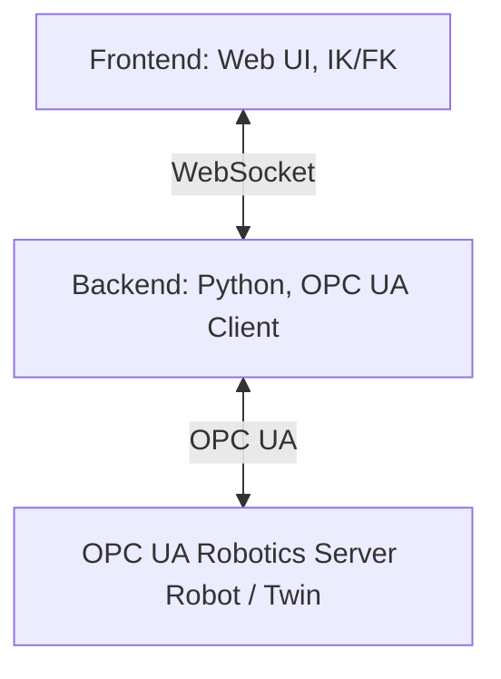

# Architecture

This document describes the technical architecture of WebSkillComposition.

## Project Structure

The project consists of a **backend** and a **frontend**.

- **Backend**  
  Written in Python. It connects to an OPC UA Robotics Server as a client.  
  It provides HTTP and WebSocket endpoints for the frontend and delivers URDF files (including meshes and textures) for supported robots.

- **Frontend**  
  A web interface for robot control.  
  It handles visualization as well as inverse kinematics (IK) and forward kinematics (FK).

## System Overview

## Design Decisions

- One shared WebSocket connection is used for multiple robots.
- Messages include the robot URL so backend and frontend can route updates correctly.
- OPC UA logic is separated from WebSocket transport logic.
- The backend keeps two robot capability layers:
  - raw OPC UA bindings (`methods`, `skills`, `variables`, `axes`)
  - normalized app-facing `actions`
- The system uses several robot instance layers for different jobs:
  - backend `RobotSessionInfo`: one discovered motion-device session from one OPC UA server
  - frontend `Robot`: the app-facing robot state derived from a discovered session and extended with UI, visual, and runtime state
  - joint-runtime / joint manager instance: the high-frequency live articulation state used for sync, drag, FK, IK, and animation
  - viewport URDF instance: the loaded Three/URDF scene object used for rendering and solver interaction
