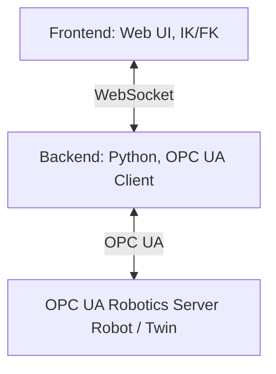

# Architecture

This document describes the technical architecture of WebSkillComposition.

## Project Structure

The project consists of a **backend** and a **frontend**.

- **Backend**  
  Written in Python. It connects to an OPC UA Robotics Server as a client.  
  It provides HTTP and WebSocket endpoints for the frontend and delivers URDF files (including meshes and textures) for supported robots.

- **Frontend**  
  A web interface for robot control.  
  It handles visualization as well as inverse kinematics (IK) and forward kinematics (FK).

## System Overview

## Design Decisions

- One shared WebSocket connection is used for multiple robots.
- Messages include the robot URL so backend and frontend can route updates correctly.
- Frontend robot state is stored per robot instead of in global movement variables.
- OPC UA logic is separated from WebSocket transport logic.
- High-frequency joint motion is kept out of the general robot store as much as possible and handled through dedicated joint-runtime logic.
- The backend keeps two robot capability layers:
  - raw OPC UA bindings (`methods`, `skills`, `variables`, `axes`)
  - normalized app-facing `actions`
- Motion-device discovery is cached per server URL so reconnecting to the same server does not require a full rediscovery walk every time.
- Supported URDF models may use different fixed mount frames in the viewport. EVA and UR5e currently use a `-90°` X mount rotation, while FR3 uses the identity mount frame.

## Robot Visualization Notes

- `robot.visual.origin` is a user-facing visual offset stored with each robot.
- The current stable setup applies the origin **translation** in the viewport.
- IK and goal-marker behavior should be treated as sensitive to robot mount frames and URDF base/tool conventions.
- Model-specific mount rotation is configured in `frontend/src/features/robot-control/model/robotModels.ts`.
