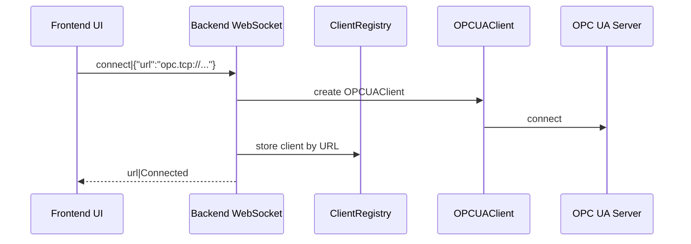
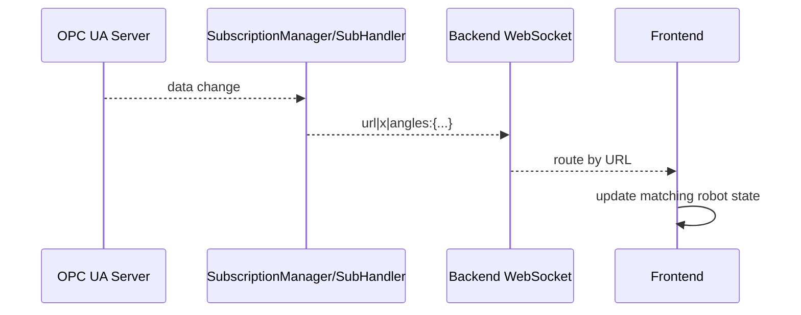

# Architecture

This document describes the technical architecture of WebSkillComposition.

## Project Structure  

The project consists of a **backend** and a **frontend**.

- **Backend**  
  Written in Python. It connects to an OPC UA Robotics Server as a client.  
  It provides HTTP and WebSocket endpoints for the frontend and delivers URDF files (including meshes and textures) for supported robots.

- **Frontend**  
  A web interface for robot control.  
  It handles visualization as well as inverse kinematics (IK) and forward kinematics (FK).

## System Overview

```mermaid
flowchart TD
    C[Backend Python, OPC UA Client] <-->|OPC UA| B[OPC UA Robotics Server Robot / Twin]
    A[Frontend: Web UI, IK/FK] <-->|WebSocket / REST(HTTP) / MCP| C[Backend: Python, OPC UA Client]
```

## Design Decisions

- One shared WebSocket connection is used for multiple robots.
- Messages include the robot URL so backend and frontend can route updates correctly.
- Frontend robot state is stored per robot instead of in global movement variables.
- OPC UA logic is separated from WebSocket transport logic.

## Runtime Flow

### Connect To OPC UA



### Stream Robot State

